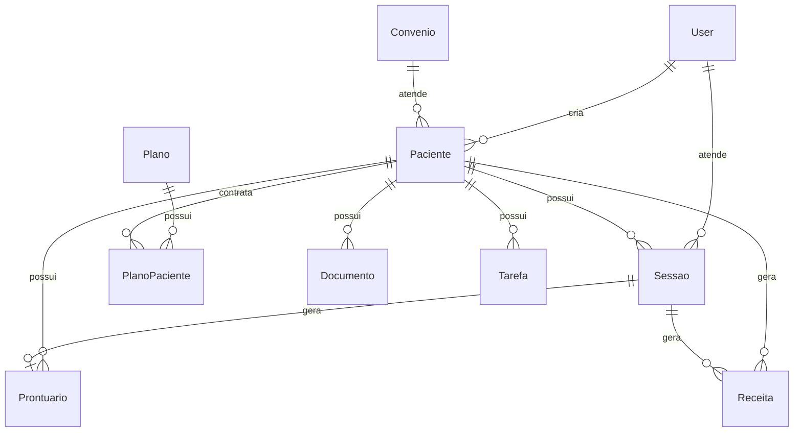

# Modelagem do Banco de Dados — PsicoFlow

## 1. Entidades Principais

O banco de dados foi modelado com relacionamentos adequados para representar o funcionamento de uma clínica psicológica.

## 2. Principais Tabelas

### User
Representa usuários do sistema.

Campos principais:
- id
- nome
- email
- senha
- role
- ativo

Relacionamentos:
- Um usuário pode criar vários pacientes.
- Um usuário psicólogo pode estar associado a várias sessões.
- Um usuário pode criar documentos, tarefas e mensagens.

### Paciente
Representa pacientes atendidos pela clínica.

Campos principais:
- id
- nome
- cpf
- email
- telefone
- dataNascimento
- endereco
- observacoes

Relacionamentos:
- Um paciente pode ter várias sessões.
- Um paciente pode ter vários prontuários.
- Um paciente pode ter várias receitas.
- Um paciente pode possuir planos.
- Um paciente pode estar associado a um convênio.

### Sessao
Representa atendimentos psicológicos agendados.

Campos principais:
- id
- dataHora
- tipo
- status
- valor
- observacoes

Relacionamentos:
- Uma sessão pertence a um paciente.
- Uma sessão pode estar associada a um psicólogo.
- Uma sessão pode ter um prontuário.
- Uma sessão pode gerar receitas.

### Prontuario
Representa registros clínicos.

Campos principais:
- id
- anamnese
- evolucao
- observacoes
- criadoEm

Relacionamentos:
- Um prontuário pertence a um paciente.
- Um prontuário pode estar vinculado a uma sessão.

### Receita
Representa entradas financeiras da clínica.

Campos principais:
- id
- descricao
- valor
- dataPagamento
- formaPagamento
- categoria
- status

Relacionamentos:
- Pode estar associada a um paciente.
- Pode estar associada a uma sessão.

### Despesa
Representa saídas financeiras da clínica.

Campos principais:
- id
- descricao
- valor
- dataPagamento
- categoria
- tipo
- status

### Plano
Representa pacotes de sessões.

Campos principais:
- id
- nome
- quantidadeSessoes
- valor
- descontoPercentual
- ativo

Relacionamentos:
- Um plano pode estar vinculado a vários pacientes por meio de PlanoPaciente.

### PlanoPaciente
Tabela de relacionamento entre pacientes e planos.

Campos principais:
- pacienteId
- planoId
- sessoesContratadas
- sessoesUtilizadas
- status

### Convenio
Representa convênios aceitos pela clínica.

Campos principais:
- id
- nome
- percentualCobertura
- percentualPaciente
- diaRepasse
- ativo

Relacionamentos:
- Um convênio pode estar associado a vários pacientes.

## 3. Diagrama DER Simplificado

## 4. Justificativa da Modelagem

A modelagem foi pensada para permitir rastreabilidade clínica e administrativa. Os principais relacionamentos garantem que uma sessão esteja vinculada a um paciente e, quando necessário, a um psicólogo e a um prontuário. O financeiro permite associar pagamentos às sessões, enquanto planos e convênios permitem controle financeiro mais detalhado.
